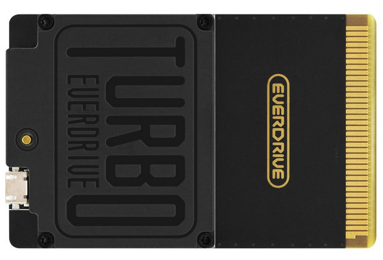

# Turbo EverDrive PRO/CORE Dev Sources

This repository contains libraries, tools and code examples for development targeting Turbo EverDrive PRO/CORE.

## Contents

| Path | Description |
|---|---|
| `/edio` | Examples of low level cartridge hardware access: SD card, USB, memory, FPGA registers, etc. |
| `/edio-cmd` | USB command scripts for the `/edio` application. |
| `/fpga` | FPGA code examples and reference projects. |
| `/hello-app` | Simple test application example. |
| `/mul-app` | Example of a custom FPGA core usage. Implements hardware multiplication using FPGA (`fpga_mul`). |
| `/edlink.py` | Basic cross-platform launcher script for `edlink.exe`. Requires Mono runtime on Linux and macOS. |
| `/edlink.exe` | USB utility for communication with EverDrive over USB. |
| `/jtag_pinout.png` | JTAG connector pinout for FPGA debugging/programming using USB Blaster. |

---

    

